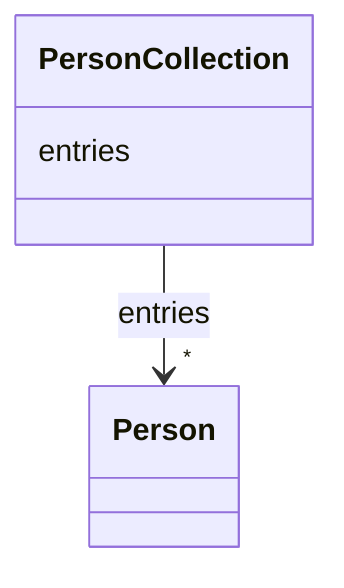

# Class: PersonCollection


_A holder for Person objects_


URI: [test_linkml_project_copier:PersonCollection](https://w3id.org/dalito/test-linkml-project-copier/PersonCollection)





<!-- no inheritance hierarchy -->


## Slots

| Name | Cardinality and Range | Description | Inheritance |
| ---  | --- | --- | --- |
| [entries](entries.md) | * <br/> [Person](Person.md) |  | direct |


## Identifier and Mapping Information


### Schema Source


* from schema: https://w3id.org/dalito/test-linkml-project-copier


## Mappings

| Mapping Type | Mapped Value |
| ---  | ---  |
| self | test_linkml_project_copier:PersonCollection |
| native | test_linkml_project_copier:PersonCollection |


## LinkML Source

<!-- TODO: investigate https://stackoverflow.com/questions/37606292/how-to-create-tabbed-code-blocks-in-mkdocs-or-sphinx -->

### Direct

<details>
```yaml
name: PersonCollection
description: A holder for Person objects
from_schema: https://w3id.org/dalito/test-linkml-project-copier
attributes:
  entries:
    name: entries
    from_schema: https://w3id.org/dalito/test-linkml-project-copier
    rank: 1000
    domain_of:
    - PersonCollection
    range: Person
    multivalued: true
    inlined: true
tree_root: true

```
</details>

### Induced

<details>
```yaml
name: PersonCollection
description: A holder for Person objects
from_schema: https://w3id.org/dalito/test-linkml-project-copier
attributes:
  entries:
    name: entries
    from_schema: https://w3id.org/dalito/test-linkml-project-copier
    rank: 1000
    alias: entries
    owner: PersonCollection
    domain_of:
    - PersonCollection
    range: Person
    multivalued: true
    inlined: true
tree_root: true

```
</details>